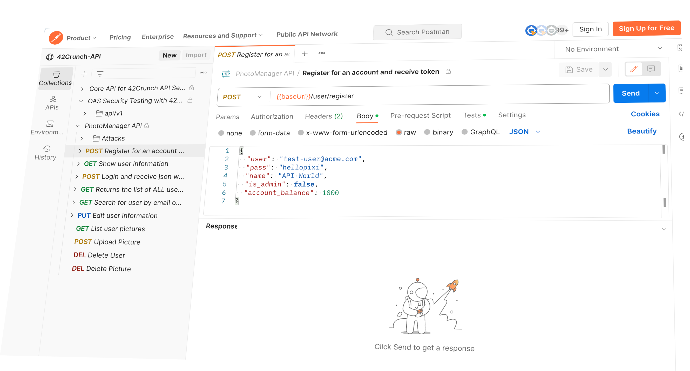
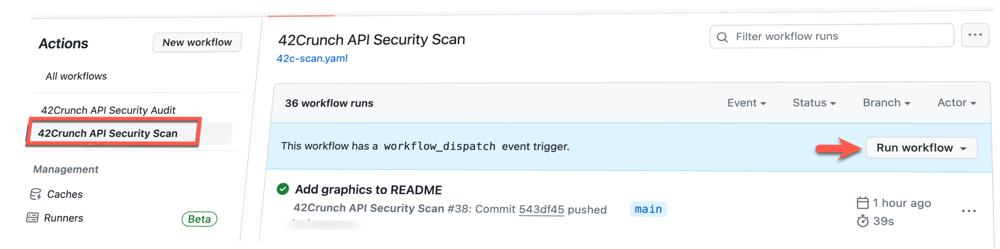
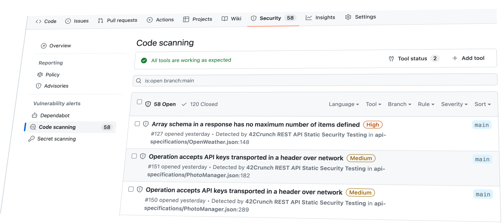
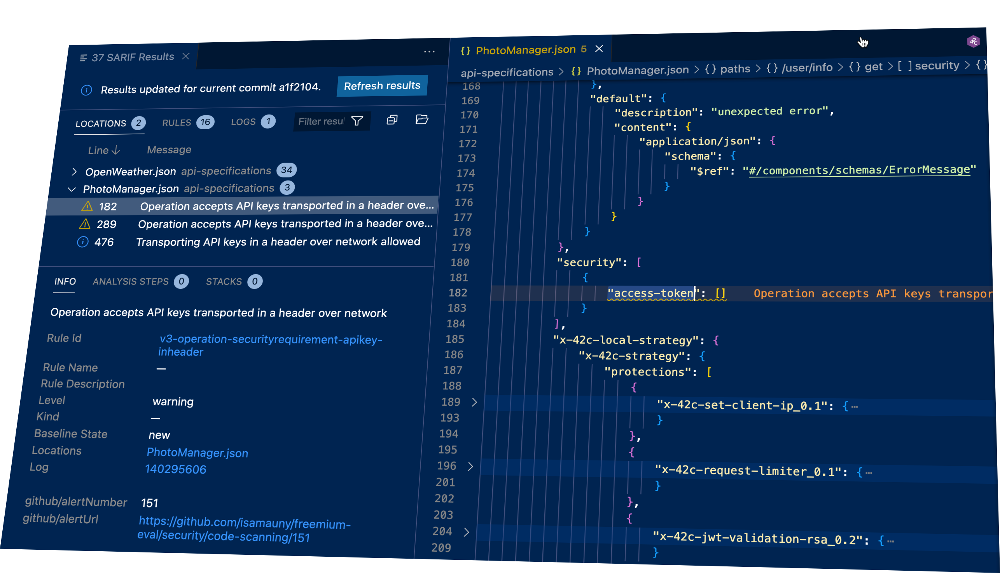

# 42Crunch Dynamic API Security Testing Tutorial

## Introduction

This tutorial walks you through the process of testing an API using 42Crunch Scan. The workflow uses Github Actions services to start a sample vulnerable API within the workflow runner, minimizing setup steps, and then runs 42Crunch Scan against the API. 

Results are made available in the SARIF format and uploaded to Github Code Scanning automatically.

## What is 42Crunch Scan?

42Crunch Scan is a dynamic API security scanner that can be used to test APIs for vulnerabilities. It leverages the API OpenAPI definition to automatically test the API for a number of issues, across authentication, authorization and improper input validation. 

42Crunch Scan also validates API responses to ensure that the API implementation conforms to its definition and does not leak additional data or stack traces for example.

The scan classifies vulnerabilities it finds according to the OWASP API Security Top 10. You can learn more about scan by watching [this short 5 mins video](https://42crunch.com/free-user-faq/).

## PhotoManager API

The API you will use is derived from an [original OWASP](https://github.com/DevSlop/Pixi) project, as part of the DevSlop workgroup. It is a vulnerable API which exposes many of the common API security issues, such as authorization deficiencies, lack of input validation or data leakage.

The repository contains a docker compose file you can use, should you want to run and test the API locally. The Postman collection to drive the API is available [here](https://www.postman.com/get-42crunch/workspace/42crunch-api/collection/13761657-2fe8d964-9687-4a95-9e16-2c06e7d5fe7e).

## Prerequisites

**GitHub Code Scanning**: this task assumes that GitHub Advanced Security is enabled on your repository. Code Scanning can be enabled for free on public repositories and for paid accounts on private repositories. You can enable Code Scanning by following the instructions [here](https://docs.github.com/en/github/finding-security-vulnerabilities-and-errors-in-your-code/about-code-scanning#enabling-code-scanning-for-a-repository).

*Note*: this tutorial leverages the [Freemium version](https://github.com/marketplace/actions/42crunch-rest-api-dynamic-security-testing-freemium) of 42Crunch Scan. It is now available for GitHubActions and will be added on more CI/CD platforms in the future.

## Running the tutorial

In order to run this tutorial, you will need to fork this repository and run the `42Crunch API Security Scan` workflow. To do this, click on the "Fork" button in the top right corner of this page.

### Enable workflows

Once you fork this repository, workflows will be disabled for security reasons. You need to enable workflows in order to run them. To do this, go to the "Actions" tab of your repository and click on the "I understand my workflows, go ahead and enable them" button.

You can check  https://docs.github.com/en/actions/managing-workflow-runs/approving-workflow-runs-from-public-forks for further details.

### Run the workflow

The workflow will run automatically when you commit changes to the repository, on branches and PRs. You can also run it manually by clicking on the "Run workflow" button.

## Viewing the results in Code Scanning

Once the workflow has completed, you can view the scan results inside the Security tab of your repository, under Code Scanning Alerts. The full SARIF report is also exported as an artifact.

## Viewing SARIF files in Visual Studio Code

Microsoft provides a [SARIF viewer extension](https://marketplace.visualstudio.com/items?itemName=MS-SarifVSCode.sarif-viewer) you can install into Visual Studio Code. Used in conjunction with [42Crunch extension](https://marketplace.visualstudio.com/items?itemName=42Crunch.vscode-openapi), it helps you view issues found by 42Crunch Audit within the OpenAPI file.

The SARIF extension, once connected to GitHub, can directly display the issues from GitHub Code Scanning.

## Conclusion

In this tutorial, you have learnt how to use 42Crunch Scan to test an API for vulnerabilities leveraging the Freemium version of 42Crunch Scan.
